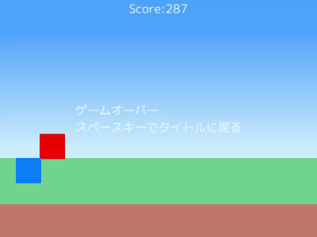

# Cpp_GameProgramming_Lesson

Visual Studio C++とOpenSiv3Dを使った、ゲームプログラミング入門用のプログラムです。

C++初学者で、初めてのゲームプログラミングをしてみようという人向けの内容になっています。

Youtubeで解説動画をアップしています。  
https://www.youtube.com/playlist?list=PLqJilCeB2ctB_X7qPTwaetZW6FDWppAgL

## 導入方法
Visual Studio 2019 と OpenSiv3Dが必要です。  
こちらの動画で解説しています。  
https://www.youtube.com/watch?v=hFDnApnzgEc

## デモ

## 使っている技術等
- 画像の描画
- キーボード入力
- キャラクターのジャンプ
- キャラクターの移動
- 矩形と矩形の衝突判定
- シーン管理
- セーブデータのセーブ/ロード
